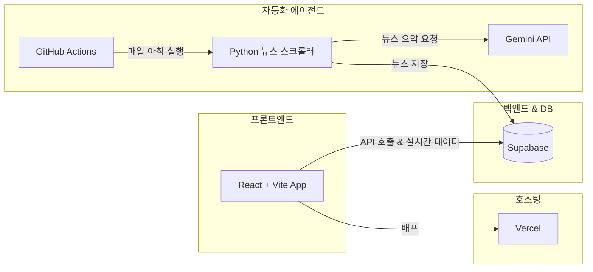

# ⚙️ 톱니바꿈월드 웹사이트 운영자 매뉴얼

본 문서는 **톱니바꿈월드** 웹사이트의 시스템 아키텍처, 관리자 대시보드 사용법, 그리고 **AI 뉴스 자동 수집 및 발행 파이프라인**에 대해 설명하는 운영 지침서입니다.

---

## 📌 목차
1. [시스템 아키텍처 개요](#1-시스템-아키텍처-개요)
2. [AI 뉴스 자동 수집 및 발행 파이프라인 (상세)](#2-ai-뉴스-자동-수집-및-발행-파이프라인-상세)
3. [관리자 대시보드 사용 가이드](#3-관리자-대시보드-사용-가이드)
4. [잠재고객(리드) 데이터 관리](#4-잠재고객리드-데이터-관리)
5. [시스템 설정 및 문제 해결 (Troubleshooting)](#5-시스템-설정-및-문제-해결-troubleshooting)

---

## 1. 시스템 아키텍처 개요

본 웹사이트는 서버리스(Serverless) 아키텍처로 설계되어 유지보수 비용이 거의 발생하지 않으며, 각 역할이 다음과 같이 분담되어 있습니다.



* **프론트엔드**: React(Vite 기반)로 구현되어 있으며, Vercel을 통해 글로벌 CDN 배포됩니다.
* **백엔드/DB**: Supabase를 사용하여 데이터 저장 및 관리자 인증을 수행합니다.
* **자동화**: GitHub Actions의 크론탭 스케줄러가 매일 아침 Python 크롤러 에이전트를 실행시킵니다.

---

## 2. AI 뉴스 자동 수집 및 발행 파이프라인 (상세)

AI 뉴스 메뉴의 콘텐츠는 매일 사람이 직접 등록하지 않고, 아래의 자동 수집 및 번역/요약 시스템을 거쳐 무인으로 업데이트됩니다.

### 🔄 뉴스 수집 흐름도 (Data Pipeline)

```mermaid
sequenceDiagram
    autonumber
    participant GA as GitHub Actions (로봇)
    participant GN as Google News RSS
    participant SB as Supabase DB
    participant GE as Gemini API
    participant ML as Microlink API

    GA->>GN: 최신 AI 관련 영문 뉴스 요청 (10개)
    GN-->>GA: 뉴스 리스트 반환
    loop 기사별 중복 확인
        GA->>SB: 기사 URL 존재 여부 조회
        SB-->>GA: 존재 여부 반환
    end
    Note over GA: 이미 등록된 기사를 제외하고<br/>최대 2개의 새로운 기사 선정
    GA->>GE: 영문 뉴스 본문 번역 및 3단 요약 요청 (JSON 포맷)
    GE-->>GA: 국문 헤드라인 및 요약문 반환
    rect rgb(30, 41, 59)
        Note over GA, ML: 썸네일 이미지 생성
        alt 유튜브 기사인 경우
            GA->>GA: 유튜브 공식 썸네일 주소 조합
        else 일반 기사인 경우
            GA->>ML: 기사 URL ➔ 페이지 캡처 이미지 요청
            ML-->>GA: 캡처 이미지 URL 반환
        end
    end
    GA->>SB: 최종 가공된 뉴스 데이터 등록 (INSERT)
    Note over SB: 웹사이트에 즉시 뉴스 발행 완료!
```



### 🛠️ 뉴스 수집 에이전트 구성 요약 (`daily_news_agent.py`)

1. **데이터 수집 (Google News RSS Feed)**:
   * **URL**: `https://news.google.com/rss/search?q=Artificial+Intelligence&hl=en-US&gl=US&ceid=US:en`
   * 구글 뉴스 영어(미국) 판에서 **`Artificial Intelligence`**로 검색된 가장 신선한 최신 기사 10개를 1차 후보군으로 가져옵니다.
2. **중복 필터링**:
   * `ai_news` 테이블의 `source_url` 컬럼에 동일한 기사 주소가 존재하는지 체크합니다.
   * 이미 수집된 뉴스인 경우 패스하고, **새롭게 수집된 뉴스 기사 중 가장 최신의 2개 기사만 가공 대상**으로 지정합니다.
3. **인공지능 번역 및 3가지 핵심 요약 (Gemini 3.5 Flash)**:
   * 선정된 영어 뉴스는 Gemini API를 통해 한국어로 요약됩니다.
   * 프롬프트 템플릿에 따라 다음의 엄격한 요약 가이드라인을 따릅니다:
     * 한국어로 번역하고, 클릭을 부르는 매력적인 헤드라인을 생성할 것.
     * 기사 내용을 **정확히 3개의 주요 포인트**로 요약할 것.
     * 요약 형식은 반드시 **`📌[1] **핵심어**: 한국어 내용...`** 형식을 지킬 것.
4. **뉴스 썸네일 자동 생성**:
   * 유튜브 기사일 경우: 유튜브 공식 썸네일 주소(`https://img.youtube.com/vi/...`)를 자동으로 매핑합니다.
   * 일반 웹사이트 기사일 경우: **Microlink API**를 호출하여 기사 본문 페이지의 가로형 웹 캡처 썸네일을 생성하여 적용합니다.
5. **데이터 적재**:
   * 가공이 끝난 뉴스는 Supabase의 `ai_news` 테이블에 입력됩니다. 입력 즉시 홈페이지 방문객 전원에게 실시간으로 포매팅되어 노출됩니다.

> [!NOTE]
> **뉴스 발행 시간 정보**:
> 데이터베이스에는 UTC 표준시로 저장되지만, 프런트엔드(`AINews.jsx`) 단에서 접속자의 로컬 타임존(한국 KST)에 맞추어 `YYYY-MM-DD HH:mm:ss` 포맷으로 자동 변환되어 읽기 쉽게 나타납니다.

---

## 3. 관리자 대시보드 사용 가이드

운영자는 웹사이트 하단의 자물쇠 아이콘이나 특정 경로로 접근하여 관리자 기능을 사용할 수 있습니다.

### 🔑 관리자 로그인
* **인증 방법**: 패스코드(Passcode) 인증
* **초기 비밀번호**: `.env` 파일의 `VITE_ADMIN_PASSCODE` 값 확인
* 관리자 비밀번호를 통해 한 번 인증되면 브라우저 세션에 로그인 상태가 유지됩니다.

### 📂 관리 항목 및 조작

1. **포트폴리오 관리 (Tab 1)**:
   * **등록**: 우측 상단 `신규 추가`를 눌러 서비스 분류(홈페이지, 인사이트, 영상제작), 서비스명, 설명, 링크(데모/노션/유튜브), 대표 이미지를 입력합니다.
   * **수정/삭제**: 우측의 연필/휴지통 아이콘을 사용합니다.
   * **순서 변경**: 목록의 드래그 앤 드롭 핸들(`GripVertical` 아이콘)을 사용하여 드래그한 후 저장하면 웹사이트의 노출 순서가 즉시 변경됩니다.
2. **AI 뉴스 대시보드 (Tab 2)**:
   * 로봇이 자동으로 수집한 뉴스 리스트가 날짜별로 표시됩니다.
   * 뉴스 기사 본문(마크다운 형태) 및 썸네일을 모니터링하고 잘못 수집된 뉴스는 삭제 처리할 수 있습니다.
3. **자료실 관리 (Tab 3)**:
   * 방문객들에게 제공할 카카오 오픈채팅 대문 이미지, 템플릿 파일 등 다운로드 가능한 리소스를 등록합니다.
   * 파일 해상도, 파일 용량, 파일 이름 정보를 기재하고, 업로드된 자료들의 다운로드 누적 횟수를 확인할 수 있습니다.

---

## 4. 잠재고객(리드) 데이터 관리

자료실에서 방문객이 자료를 다운로드하기 위해 이름과 이메일을 입력하면, 마케팅을 위한 잠재고객 데이터가 수집됩니다.

### 📥 리드 수집 및 다운로드 과정
1. 방문객이 자료실에서 리소스의 `다운로드` 클릭.
2. 이름과 이메일 주소를 묻는 팝업 창 노출.
3. 입력 시 데이터베이스(`marketing_leads` 테이블)에 입력 시각, 고객명, 이메일 주소, 요청한 리소스명이 기록됨.
4. 동시에 방문객에게는 파일 다운로드 처리가 실행됨.

### 📊 리드 데이터 활용 (관리자 전용)
* 관리자 대시보드의 **`잠재고객 수집 리드`** 탭에서 수집된 전체 이메일 리스트를 실시간으로 확인 가능합니다.
* **`CSV 내보내기`** 버튼을 누르면 인코딩 오류(한글 깨짐)가 방지된 UTF-8 BOM 양식의 `.csv` 엑셀 파일로 리스트를 일괄 다운로드하여 마케팅 도구(스티비, 메일침프 등)에 주소록을 이식할 수 있습니다.

---

## 5. 시스템 설정 및 문제 해결 (Troubleshooting)

### 🚨 트러블슈팅: "뉴스 로봇이 글을 쓰지 못하는 에러 (RLS 정책 오류)"
만약 Supabase에서 테이블 보안 설정을 변경하거나 RLS(Row Level Security)를 활성화한 뒤 뉴스가 새로 등록되지 않는다면, API 권한 정책의 위반을 점검해야 합니다.

> [!WARNING]
> RLS 정책이 켜져 있으면, 공개용 API 키(`anon`)로는 보안을 위해 `ai_news` 테이블에 글을 쓰는 것(INSERT)이 차단됩니다. 이를 방지하기 위해 다음 두 가지 해결책 중 하나를 적용해야 합니다.

#### 해결책 A (권장): GitHub Secrets의 API 키 수정
비밀번호가 보장되는 GitHub Actions 서버 내에서 실행되는 로봇이므로, RLS 규칙을 모두 무시할 수 있는 **`service_role` 관리자 키**를 사용하게 설정하는 것이 보안상 가장 우수합니다.
1. **Supabase Dashboard** ➔ **Settings** ➔ **API** 이동.
2. `service_role` key 값을 복사 (절대 브라우저 코드 등 외부에 노출하지 마세요).
3. **GitHub Repository** ➔ **Settings** ➔ **Secrets and variables** ➔ **Actions** 이동.
4. `SUPABASE_KEY` 비밀 값의 내용에 복사해 둔 `service_role` 키를 업데이트하여 저장합니다.

#### 해결책 B: SQL Editor를 이용해 쓰기 권한 추가
공개 `anon` 키로도 뉴스 기사를 등록할 수 있도록 Supabase DB 정책에 규칙을 심어줍니다.
1. **Supabase Dashboard** ➔ **SQL Editor** 메뉴 클릭.
2. **`New query`**를 연 다음 아래의 쿼리를 입력하고 **`Run`** 실행.
   ```sql
   CREATE POLICY "Enable insert for anon (crawler)" 
   ON public.ai_news 
   FOR INSERT 
   TO anon 
   WITH CHECK (true);
   ```

#### 🚨 트러블슈팅: "AI 뉴스가 실시간으로 등록되지 않는 문제 (Gemini API 503 오류 및 수동 재발행)"
만약 매일 아침 뉴스가 올라오지 않았다면, Google Gemini API 서버의 일시적인 가용성 장애(503 Service Unavailable) 등으로 인해 요약 단계가 패스된 것일 수 있습니다. (현재는 자동 대체 모델 Fallback 로직이 내장되어 3.5-flash 실패 시 1.5-flash 모델로 우회 시도합니다)

**해결책: GitHub Actions에서 수동 재발행 및 에러 확인**
현재 깃허브 워크플로우에 수동 실행 기능(`workflow_dispatch`)이 연동되어 있어 실패 시 에러 로그를 확인하거나 즉시 재발행할 수 있습니다.
* **직접 실행 및 에러 확인 주소**: [GitHub Actions Daily AI News Workflow](https://github.com/ParkJinHee67/ai-world-homepage/actions/workflows/daily_news.yml)
1. 위의 주소로 접속하거나, GitHub 저장소 상단 탭 메뉴의 **Actions** ➔ 좌측 목록에서 **`Daily AI News Auto Publisher`**를 선택합니다.
2. 실행 목록에서 가장 최근 실패(빨간색 ❌ 표시)한 항목이 있다면 클릭하여 어떤 부분에서 에러가 났는지 로그를 확인할 수 있습니다.
3. 수동 재발행을 원할 경우 우측의 **`Run workflow`** 버튼을 누르고 초록색 **`Run workflow`**를 한 번 더 클릭하여 실행합니다.
4. 약 1분 후 동작이 완료되면 홈페이지의 AI 뉴스 탭에서 즉시 확인 가능합니다.

---

### 🔑 주요 환경 변수 설정 (.env / GitHub Secrets)

프로젝트 빌드 및 스크립트 실행에 필요한 환경 변수 목록입니다.

| 변수명 | 위치 | 설명 |
| :--- | :--- | :--- |
| `VITE_SUPABASE_URL` | `.env` / Vercel | Supabase 프로젝트 API 접속 URL |
| `VITE_SUPABASE_ANON_KEY` | `.env` / Vercel | 클라이언트용 공개 API 키 (`anon`) |
| `VITE_ADMIN_PASSCODE` | `.env` / Vercel | 관리자 대시보드 로그인 패스코드 |
| `SUPABASE_URL` | GitHub Secrets | 뉴스 로봇이 호출할 Supabase URL |
| `SUPABASE_KEY` | GitHub Secrets | 뉴스 로봇용 API 키 (안전을 위해 `service_role` 권장) |
| `GEMINI_API_KEY` | GitHub Secrets | 구글 Gemini 요약용 무료 API 키 |
